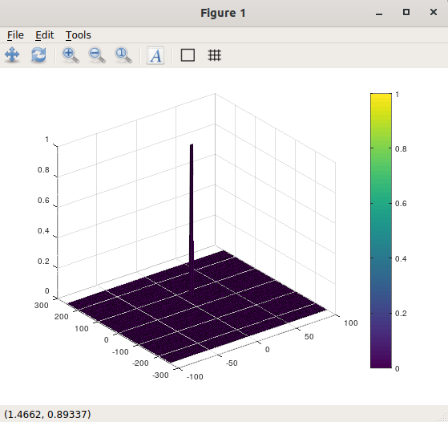

# SFND-Radar

This project is part of the sensor fusion nanodegree of Udacity under the Radar Module
## Goal
  - Configure the FMCW  waveform from the system requirements
  
    Frequency of operation = 77GHz

    Max Range = 200m

    Range Resolution = 1 m

    Max Velocity = 70 m/s

  - Define velocity and range and simulate there displacement

  - Determine the beat signal

  - Perform Range FFT on the signal

  - Perform the CFAR processing on the output of the second FFT to display the target

## Implementation steps

- First we loop over elements of RDM array each iteration selecting one cell to be the cell under test
  - For each time sample we need to pdate the transmitted and recieved signal
  
    `Tx(i) = cos( 2*pi*( fc*t(i) + (0.5*slope*t(i)^2) ) ); transmited signal`

    `Rx(i) = cos( 2*pi*( fc*tnew + (0.5*slope*tnew^2) ) ); recieved signal`

  - Next we iterate over the training cells to sum their values and during this process we exclude the guarding cells  

    `for i = Tr+Gr+1 : (Nr/2)-(Gr+Tr)`
      `for j = Td+Gd+1 : Nd-(Gd+Td)`
  - We then calculate the average of the noise values

    `noise_level = noise_level + db2pow(RDM(p,q));`

  - We add the offset value and if the CUT is greater then the threshold we replace it by a 1 otherwise we replace it with 0

## Selection of Training, Guard cells and offset
- `Tr = 7, Td = 5` Range and Doppler Training Cells
- `Gr = 3, Gd = 4` Range and Doppler Guard Cells
- `offset = 1.2` offset value. 

## Results

This is the result of a target at 60m traveling with a velocity of 10m/s

